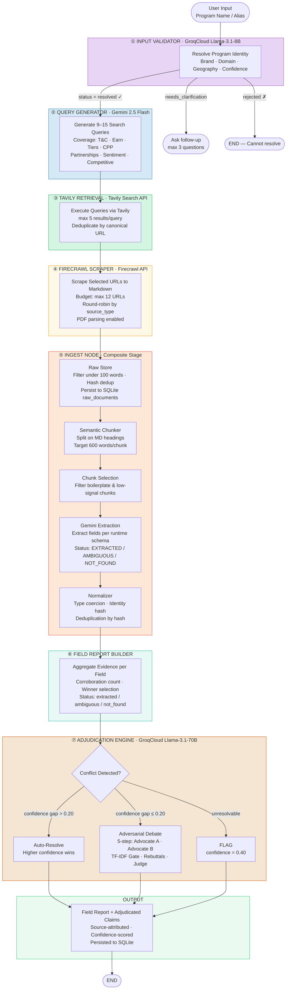
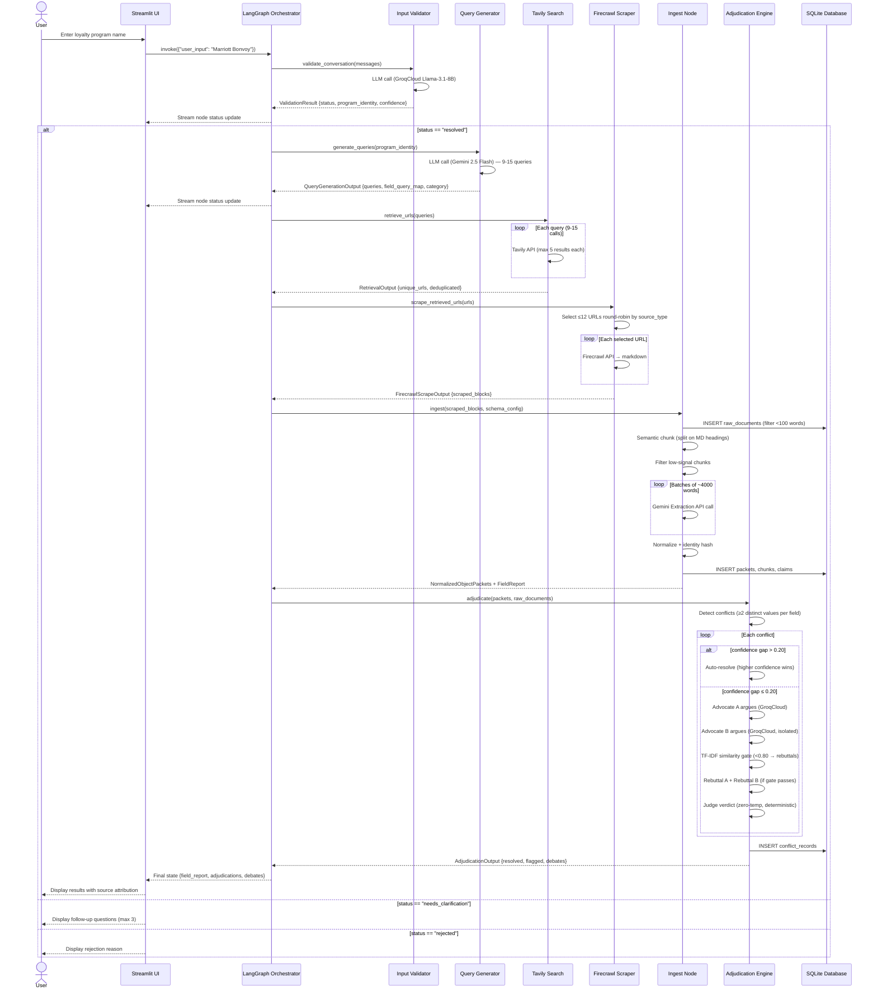
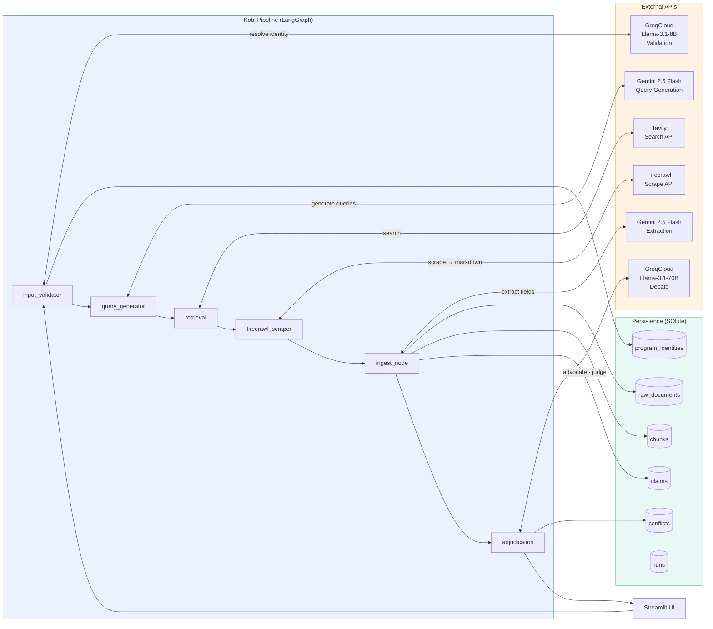
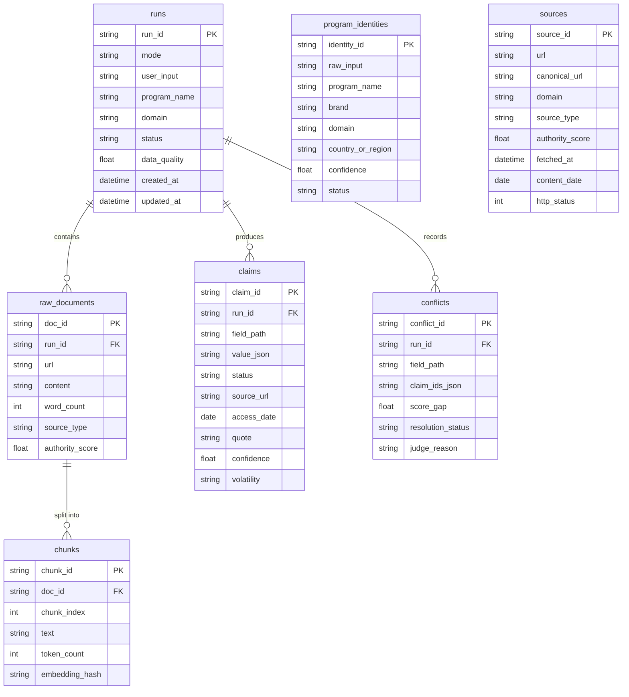
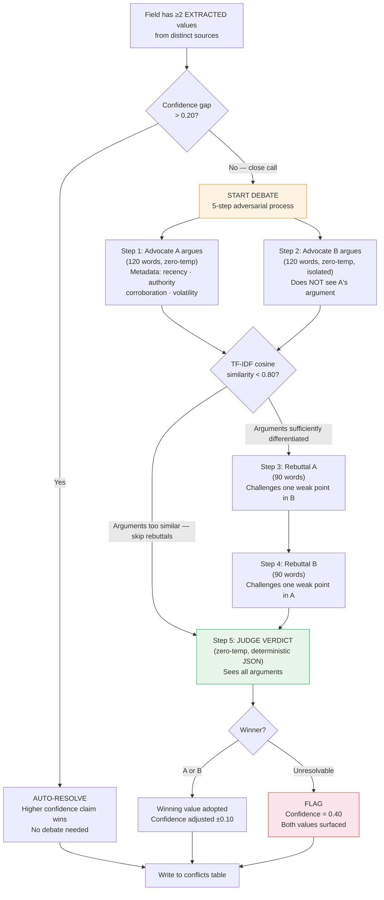

# Kobi Phase 2 — Full Architecture Documentation
### Loyalty Intelligence Research Pipeline
> **For mentor review and project audit**
> Generated: June 2026 | Branch: `main`

---

## Table of Contents
1. [System Overview](#1-system-overview)
2. [Pipeline Flowchart](#2-pipeline-flowchart)
3. [Data Flow Sequence Diagram](#3-data-flow-sequence-diagram)
4. [Component & API Integration Map](#4-component--api-integration-map)
5. [Stage-by-Stage Component Reference](#5-stage-by-stage-component-reference)
6. [Data Schemas](#6-data-schemas)
7. [Database Schema](#7-database-schema)
8. [Adjudication & Debate Engine](#8-adjudication--debate-engine)
9. [Environment Variables Reference](#9-environment-variables-reference)
10. [Test Coverage Map](#10-test-coverage-map)

---

## 1. System Overview

**Kobi Phase 2** is a **grounded evidence-based competitive intelligence agent** for loyalty programs. It researches loyalty program details via a fully automated, multi-stage validation pipeline that enforces strict source attribution — every fact must have a source URL and access date. The system never relies on LLM training-data knowledge; all claims originate from live web evidence.

### Core Principles
| Principle | Implementation |
|-----------|---------------|
| **No hallucinations** | Every extracted field requires `source_url` + `access_date` or is marked `NOT_FOUND` |
| **Conflict resolution** | Adversarial debate engine adjudicates contradictory evidence |
| **Volatility-aware** | High-volatility fields (earn rates, CPP) weight recency; low-volatility fields weight authority |
| **Traceable provenance** | Full chain from raw URL → chunk → extracted claim → adjudicated fact |
| **Runtime schema** | Schema is passed at call-time, not hard-coded — the extractor is schema-agnostic |

### Technology Stack
| Layer | Technology |
|-------|-----------|
| Orchestration | LangGraph (StateGraph) |
| UI | Streamlit |
| Database | SQLite (via SQLAlchemy) |
| Search | Tavily Search API |
| Web Scraping | Firecrawl API |
| LLM — Validation | GroqCloud (Llama-3.1-8B) |
| LLM — Query Gen + Extraction | Google Gemini 2.5 Flash |
| LLM — Debate | GroqCloud (Llama-3.1-70B) |

---

## 2. Pipeline Flowchart

> **Paste this block into Eraser → New Diagram → Flowchart → "Import Mermaid"**



---

## 3. Data Flow Sequence Diagram

> **Paste into Eraser → New Diagram → Sequence Diagram → "Import Mermaid"**



---

## 4. Component & API Integration Map

> **Paste into Eraser → New Diagram → Flowchart → "Import Mermaid"**



---

## 5. Stage-by-Stage Component Reference

### Stage 1 — Input Validator
| Property | Value |
|----------|-------|
| **File** | `pipeline/nodes/validation.py` |
| **LLM** | GroqCloud — `llama-3.1-8b-instant` |
| **Input** | User free-text (program name or alias) |
| **Output** | `ValidationResult` → `ProgramIdentity` |
| **Confidence threshold** | 0.90 required to resolve |
| **Output statuses** | `resolved` · `needs_clarification` · `rejected` |
| **Routing** | Resolves → continue; else → END |
| **DB write** | `program_identities` table |
| **Env vars** | `INPUT_VERIFIER_API_KEY`, `INPUT_VERIFIER_API_BASE`, `INPUT_VERIFIER_MODEL` |

**`ProgramIdentity` fields:**
```
program_name, brand, domain (industry), country_or_region,
confidence (0–1), possible_matches, follow_up_questions
```

---

### Stage 2 — Query Generator
| Property | Value |
|----------|-------|
| **File** | `query_generator.py` |
| **LLM** | Gemini 2.5 Flash (REST API) |
| **Input** | `ProgramIdentity` |
| **Output** | `QueryGenerationOutput` (9–15 `SearchQuery` objects) |
| **Query count constraint** | 9 minimum, 15 maximum (hard rule) |
| **Query length** | 3–7 words preferred, max 10 |
| **Coverage required** | T&C, Earn, Tiers, CPP, Partners, Devaluations, History, Membership scale, Sentiment, Competitive, Digital/App |
| **Env vars** | `GEMINI_API_KEY`, `GEMINI_API_BASE`, `QUERY_GENERATOR_MODEL`, `QUERY_GENERATOR_FALLBACK_MODELS` |

**`QueryGenerationOutput` fields:**
```
detected_category (AIRLINE/HOTEL/BANKING/RETAIL/COALITION/OTHER)
resolved_corporate_parent
geography (IN/US/UK/GLOBAL)
priority_fields []
query_strategy_summary
estimated_web_coverage (0–1)
field_query_map { field_path → [query_ids] }
queries [ {query_id, query_text, intent, source_types, priority_fields} ]
```

---

### Stage 3 — Tavily Retrieval
| Property | Value |
|----------|-------|
| **File** | `pipeline/nodes/retrieval.py` |
| **API** | Tavily Search REST |
| **Input** | List of `SearchQuery` |
| **Output** | `RetrievalOutput` — deduplicated URL list |
| **Results per query** | `max_results = 5` |
| **Deduplication** | By canonical URL; best score wins |
| **Note** | URLs only — no content fetched here |
| **Env vars** | `TAVILY_API_KEY`, `TAVILY_API_BASE` |

**`RetrievedUrl` fields:**
```
url, canonical_url, title, score, source_type
(official/terms/faq/financial/news/review/app_reviews/forum)
query_id, authority_score
```

---

### Stage 4 — Firecrawl Scraper
| Property | Value |
|----------|-------|
| **File** | `pipeline/nodes/firecrawl_scraper.py` |
| **API** | Firecrawl REST |
| **Input** | `RetrievedUrl` list |
| **Output** | `FirecrawlScrapeOutput` — markdown per URL |
| **URL budget** | 12 URLs default (env: `MAX_FIRECRAWL_URLS`) |
| **Selection strategy** | Round-robin by source_type to preserve coverage diversity |
| **Priority order** | official > terms > financial > faq > partners > review > news > forum > competitors |
| **PDF support** | Enabled (annual reports, prospectuses) |
| **Env vars** | `FIRECRAWL_API_KEY`, `FIRECRAWL_API_BASE` |

---

### Stage 5 — Ingest Node (Composite)
**File:** `pipeline/nodes/ingest_node.py` orchestrates five sub-stages:

#### 5a. Raw Store
| Property | Value |
|----------|-------|
| **File** | `pipeline/stages/raw_store.py` |
| **Filter** | Drop pages < 100 words |
| **Dedup** | Hash URL; update on reprocess (idempotent) |
| **DB write** | `raw_documents` table |

#### 5b. Semantic Chunker
| Property | Value |
|----------|-------|
| **File** | `pipeline/stages/chunker.py` |
| **Split on** | Markdown headings H1–H6 |
| **Min section** | 30 words |
| **Target chunk** | 600 words |
| **Max chunk** | 1 500 words |
| **Boilerplate removal** | Lines ≤8 words matching nav/legal patterns |

#### 5c. Chunk Selection
| Property | Value |
|----------|-------|
| **File** | `pipeline/stages/extractor.py::select_informative_chunks` |
| **Signal check** | Program name/brand presence + keyword density |
| **Output** | `extraction_chunks` (keep) + `skipped_chunks` (discard) |

#### 5d. Gemini Extraction
| Property | Value |
|----------|-------|
| **File** | `pipeline/stages/extractor.py::extract_from_chunks` |
| **LLM** | Gemini 2.5 Flash, temperature = 0 |
| **Batch size** | 4 000 words (env: `EXTRACTION_BATCH_WORDS`) |
| **Concurrency** | ThreadPoolExecutor (env: `GEMINI_EXTRACTION_CONCURRENCY`) |
| **Schema** | Runtime-injected `SchemaConfig` (caller-provided field defs) |
| **Field statuses** | `EXTRACTED` · `AMBIGUOUS` · `NOT_FOUND` |
| **Per field** | value, status, source_url, source_snippet, confidence |

#### 5e. Normalizer
| Property | Value |
|----------|-------|
| **File** | `pipeline/stages/normalizer.py` |
| **Operations** | Trim whitespace, type coercion |
| **Identity hash** | SHA deterministic hash from identity fields + geography scope |
| **Purpose** | Prevent duplicate packets from same source reaching adjudication |

---

### Stage 6 — Field Report Builder
| Property | Value |
|----------|-------|
| **File** | `pipeline/stages/field_report.py` |
| **Input** | All `NormalizedObjectPacket` objects |
| **Output** | `FieldReport` — one `FieldReportEntry` per schema field |
| **Winner selection** | Highest corroboration count + confidence |
| **Tracks** | source_urls, snippet, confidence, corroboration_count per field |
| **Counts** | `extracted_count`, `ambiguous_count`, `not_found_count` |

---

### Stage 7 — Adjudication Engine
| Property | Value |
|----------|-------|
| **File** | `adjudication/conflict_adjudicator.py` + `adjudication/debate_engine.py` |
| **LLM** | GroqCloud Llama-3.1-70B, temperature = 0 |
| **Conflict trigger** | ≥2 distinct EXTRACTED values for same field from distinct sources |
| **Auto-resolve** | Confidence gap > 0.20 → higher confidence wins |
| **Debate trigger** | Confidence gap ≤ 0.20 |
| **Concurrency limit** | Semaphore(3) — protects Groq free-tier rate limits |
| **Env vars** | `GROQ_API_KEY`, `DEBATE_API_KEY`, `DEBATE_MODEL` |

---

## 6. Data Schemas

### Core Pydantic Models (`schemas.py`)

```
ProgramIdentity
  program_name: str
  brand: str
  domain: str          # Airline / Hotel / Banking / Retail / Coalition
  country_or_region: str
  confidence: float    # 0.0–1.0

ValidationResult
  status: "resolved" | "needs_clarification" | "rejected"
  identity: ProgramIdentity | None
  possible_matches: list[str]
  follow_up_questions: list[str]  # max 3

QueryGenerationOutput
  detected_category: str
  resolved_corporate_parent: str | None
  geography: str | None
  priority_fields: list[str]
  query_strategy_summary: str
  estimated_web_coverage: float
  field_query_map: dict[str, list[str]]
  queries: list[SearchQuery]

SearchQuery
  query_id: str
  query_text: str
  intent: str
  source_types: list[str]
  priority_fields: list[str]

RetrievedUrl
  url: str
  canonical_url: str
  title: str | None
  score: float
  source_type: str
  query_id: str
  authority_score: float

RawDocument
  doc_id: str
  url: str
  content: str
  word_count: int
  source_type: str
  authority_score: float

SemanticChunk
  chunk_id: str
  chunk_text: str
  source_url: str
  target_fields: list[str]
  word_count: int

ExtractedField
  value: Any
  status: "EXTRACTED" | "AMBIGUOUS" | "NOT_FOUND"
  confidence: float
  source_url: str | None
  source_snippet: str | None

ExtractedObjectPacket
  fields: dict[str, ExtractedField]   # keyed by field_path
  source_url: str
  chunk_id: str
  scope: str

NormalizedObjectPacket
  (ExtractedObjectPacket) + identity_hash: str + normalized_at: datetime

FieldReportEntry
  field_path: str
  status: "extracted" | "ambiguous" | "not_found"
  value: Any
  source_urls: list[str]
  snippet: str | None
  confidence: float
  corroboration_count: int

Claim                                  # persisted to DB
  field_path: str
  value_json: str
  status: ClaimStatus
  source_url: str
  access_date: date
  quote: str | None
  confidence: float
  volatility: "HIGH" | "LOW"

ConflictRecord                         # persisted to DB
  field_path: str
  claim_ids: list[str]
  score_gap: float
  resolution_status: "auto" | "debate" | "flagged"
  judge_reason: str | None
```

### Schema Field Paths (45 fields across 8 sections)
```
program_basics
  .program_name  .brand  .industry  .program_type
  .geography  .membership_count  .program_age  .recent_changes

earn_mechanics
  .base_earn_rate  .earn_rate_unit  .bonus_categories
  .co_brand_card_earn  .partner_earn  .earn_expiry

burn_mechanics
  .redemption_options  .redemption_thresholds  .point_value_cpp
  .expiry_policy  .reinstatement_policy

tier_system
  .tier_names  .qualification_criteria  .tier_thresholds
  .qualification_period  .tier_benefits  .fast_track

partnerships
  .partner_names  .partnership_type  .details
  .earn_details  .burn_details

digital_experience
  .mobile_app_available  .app_ratings
  .personalization_features  .digital_wallet

member_sentiment
  .ratings  .common_praise  .common_complaints
  .review_sources_checked

competitive_position
  .key_differentiators  .weaknesses
  .closest_competitors  .market_position
```

### Volatility Classification
| Classification | Fields |
|----------------|--------|
| **HIGH** (weight recency 50%) | `earn_rate`, `tier_thresholds`, `cpp`, `app_ratings`, `recent_changes` |
| **LOW** (weight authority 50%) | `program_name`, `tier_names`, `brand`, `industry`, `geography` |

---

## 7. Database Schema

> **Paste into Eraser → New Diagram → Entity Relationship → "Import Mermaid"**



---

## 8. Adjudication & Debate Engine

### Conflict Resolution Flow



### Volatility Weights Applied by Judge
| Signal | HIGH Volatility Fields | LOW Volatility Fields |
|--------|----------------------|----------------------|
| **Recency** | 50% | 20% |
| **Authority** | 25% | 50% |
| **Corroboration** | 25% | 30% |

### Authority Tier Ordering (strongest → weakest)
```
official  >  major_publication  >  news  >  aggregator  >  forum
```

### Judge JSON Output Schema
```json
{
  "winner": "A" | "B" | "FLAG",
  "winning_value": "string | null",
  "deciding_factor": "recency | authority | corroboration | rebuttal_quality | unresolvable",
  "reasoning": "string",
  "rebuttal_assessment": {
    "A_rebuttal": "strong | weak | hallucinated",
    "B_rebuttal": "strong | weak | hallucinated"
  },
  "confidence_adjustment": "float (-0.10 to +0.10)"
}
```

---

## 9. Environment Variables Reference

### Provider Keys
| Variable | Stage | Default Model |
|----------|-------|--------------|
| `INPUT_VERIFIER_API_KEY` | Input Validation | — |
| `INPUT_VERIFIER_API_BASE` | Input Validation | GroqCloud endpoint |
| `INPUT_VERIFIER_MODEL` | Input Validation | `llama-3.1-8b-instant` |
| `GEMINI_API_KEY` | Query Gen + Extraction | — |
| `GEMINI_API_BASE` | Query Gen + Extraction | Google endpoint |
| `QUERY_GENERATOR_MODEL` | Query Generation | `gemini-2.5-flash` |
| `QUERY_GENERATOR_FALLBACK_MODELS` | Query Generation | comma-separated list |
| `QUERY_GENERATOR_MAX_RETRIES` | Query Generation | 3 |
| `EXTRACTION_API_KEY` | Extraction | (uses GEMINI_API_KEY) |
| `EXTRACTION_MAX_RETRIES` | Extraction | 3 |
| `EXTRACTION_RETRY_SLEEP_SECONDS` | Extraction | 2 |
| `EXTRACTION_BATCH_WORDS` | Extraction | 4000 |
| `TAVILY_API_KEY` | Retrieval | — |
| `TAVILY_API_BASE` | Retrieval | Tavily endpoint |
| `FIRECRAWL_API_KEY` | Scraping | — |
| `FIRECRAWL_API_BASE` | Scraping | Firecrawl endpoint |
| `GROQ_API_KEY` | Debate | — |
| `DEBATE_API_KEY` | Debate | (uses GROQ_API_KEY) |
| `DEBATE_MODEL` | Debate | `llama3-70b-8192` |

### Tuning Knobs
| Variable | Purpose | Default |
|----------|---------|---------|
| `MAX_FIRECRAWL_URLS` | URL scraping budget | 12 |
| `MAX_EXTRACTION_CHUNKS` | Max chunks sent to Gemini | 30 |
| `GEMINI_EXTRACTION_CONCURRENCY` | Parallel Gemini calls | 1 |

---

## 10. Test Coverage Map

| Test File | What It Tests | Key Assertions |
|-----------|--------------|----------------|
| `tests/test_validation.py` | LLM-backed program identity resolution | Status codes, confidence thresholds, rejection cases |
| `tests/test_query_generator.py` | Gemini query planning | Query count (9–15), field_query_map coverage, no-placeholder rule |
| `tests/test_graph.py` | LangGraph end-to-end workflow | Node routing, state propagation, error handling |
| `tests/test_post_firecrawl_pipeline.py` | Chunking → Extraction → Normalization chain | Chunk sizes, field status codes, identity hash dedup |
| `tests/test_adjudication.py` | Conflict detection + debate engine + auto-resolve | Confidence gap thresholds, judge verdict schema, FLAG behavior |
| `tests/test_providers.py` | Provider configuration loading | Env var overrides, fallback model lists |
| `tests/test_db.py` | SQLite persistence | Insert/read round-trip for all tables |
| `tests/test_providers.py` | Provider config isolation | Stage-specific model selection |

---

## Quick Reference: End-to-End Example

```
Input:  "Marriott Bonvoy"
         ↓
Validated: Marriott Bonvoy | brand=Marriott | domain=Hotel | confidence=0.98
         ↓
12 queries generated covering earn/tiers/CPP/partners/sentiment
         ↓
35 unique URLs retrieved via Tavily (12 queries × 5 results, deduplicated)
         ↓
12 URLs scraped by Firecrawl (budget cap, round-robin selection)
         ↓
11 RawDocuments stored (1 filtered — under 100 words)
         ↓
47 semantic chunks created, 38 selected (9 discarded as boilerplate)
         ↓
85 ExtractedObjectPackets from Gemini (batched, concurrent)
         ↓
82 NormalizedObjectPackets (3 duplicates removed by identity hash)
         ↓
FieldReport: 23 extracted | 4 ambiguous | 3 not_found
         ↓
Adjudication: 2 conflicts found
  - CPP conflict (0.9 vs 0.85): gap=0.05 → DEBATE → A wins (recency + authority)
  - partner_names: gap=0.30 → AUTO-RESOLVE → higher confidence wins
         ↓
Output: 25 source-attributed, confidence-scored fields + full debate transcript
```

---

*Document generated from codebase at commit `8e18993`. For questions, see inline source files referenced per stage above.*
