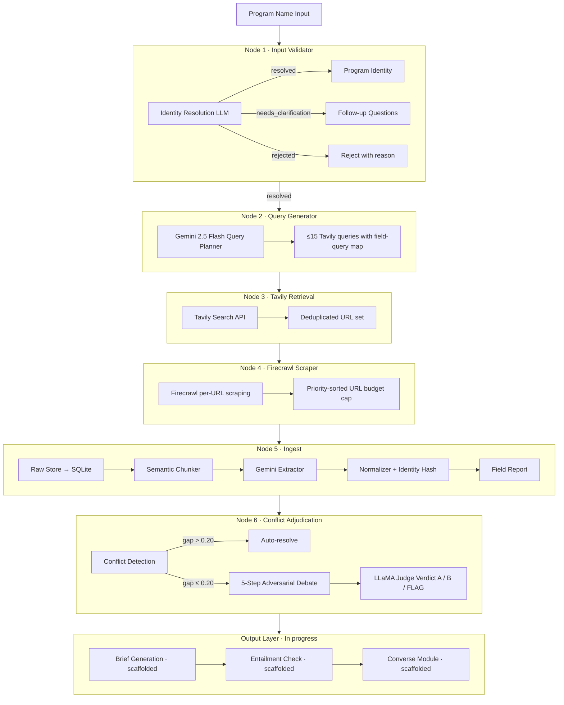

# Autonomous Competitive Intelligence Agent
### Kobie AI Hackathon 2026 · Phase 2 · Project Progress Document

| | |
|---|---|
| **Team** | Shreyas R Gowda · Shreeram G Patgar · Naveen G |
| **Institution** | R.V. College of Engineering (RVCE), Bengaluru |
| **Domain** | Loyalty Program Competitive Intelligence |
| **Status** | Core pipeline complete · Adjudication live · Brief generation scaffolded |
| **Last updated** | 13 June 2026 |

---

## 1. Executive Summary

We are building an **Autonomous Competitive Intelligence (ACI) Agent** that takes the name of any loyalty program (e.g. "Marriott Bonvoy", "Air India Maharaja Club") and autonomously produces a structured, source-grounded competitive intelligence brief covering how the program earns, burns, tiers, partners, and how members feel about it.

The system is a **6-node LangGraph pipeline** built around two hard problems in this space: *source contradiction* (different sites publish different earn rates / point values) and *temporal drift* (programs rebrand and revise rules over time). The pipeline runs end-to-end from a raw program name through retrieval, scraping, extraction, normalization, and adversarial conflict adjudication. Brief generation and the converse module are the remaining output-layer items.

---

## 2. Problem Statement & Objective

Loyalty programs are documented inconsistently across official pages, terms-and-conditions, investor filings, review forums, and SEO blog content. Manually researching one program to a usable competitive standard takes hours and the result goes stale quickly.

**Objective:** Transform a single program name into a *single, unambiguous, source-grounded canonical record* of that program — automatically, with confidence scoring and full provenance — while resisting SEO echo chambers, hallucination, and outdated data.

**Success criteria for the MVP:**
- Resolve any reasonable user input to one canonical program identity.
- Populate the full loyalty schema (8 object groups) with `null` where unknown — never invented.
- Detect and reconcile conflicting values across sources with an auditable confidence basis.
- Preserve historical state (rebrands, rule changes) rather than overwriting.

---

## 3. Team & Roles

| Member | Focus area |
|---|---|
| Shreyas R Gowda | Pipeline orchestration, extraction schema, reconciliation logic |
| Shreeram G Patgar | Retrieval layer, source handling, deduplication |
| Naveen G | Output layer (brief generation), evaluation, sentiment sourcing |

*Roles are working assignments and overlap during build sprints.*

---

## 4. System Overview

The agent runs as a **LangGraph state machine** with 6 pipeline nodes. The ingest node internally runs 5 sequential sub-stages (raw store → chunker → extractor → normalizer → field report), making it the densest node in the graph.



**Two views of the same system:**

- *Orchestration view (LangGraph nodes):* Input Validator → Query Generator → Retrieval → Firecrawl Scraper → Ingest → Conflict Adjudication.
- *Data view (pipeline stages):* raw web text → deduplicated URL set → scraped markdown → stored raw documents → semantic chunks → extracted object packets → normalized packets → field report → adjudicated canonical values → competitive brief.

---

## 5. Architecture — Node by Node

**Node 1 — Input Validator.** Resolves messy user input into one canonical program identity (handling aliases, abbreviations, rebrands, partial names) across supported domains (Airline, Hotel, Retail, Banking/Credit Card, Coalition, Telecom, Fuel, E-commerce, Gaming, Other). Asks at most 3 clarifying questions, prefers multiple choice, and only asks when confidence < 0.90.

- **≥ 0.90 confidence:** returns `{status: "resolved", program_name, brand, domain, country_or_region, confidence}`.
- **< 0.90 confidence:** returns `{status: "needs_clarification", possible_matches[], follow_up_questions[]}`.
- **Rejected:** returns `{status: "rejected", reason}` for non-loyalty inputs.

**Node 2 — Query Generator.** Takes the validated program identity, understands the schema, prioritizes difficult/very-difficult fields, and emits ≤ 15 category-specific Tavily queries with a `field_query_map` linking each field to the query IDs that target it. Powered by Gemini 2.5 Flash. Includes a JSON fallback to `FALLBACK_QUERIES[category]` if the LLM output is malformed.

- **Field difficulty tiers** guide query budget: *easy* fields (name, brand, tier names) get few queries; *very difficult* fields (point value, partnership type, sentiment, differentiators, competitors) get focused, source-specific queries (Reddit, Trustpilot, FlyerTalk, App Store named explicitly).

**Node 3 — Tavily Retrieval.** Executes the query set against the Tavily Search API and returns a deduplicated URL set with source-type metadata (official, financial, forum, review, etc.) and Tavily relevance scores.

**Node 4 — Firecrawl Scraper.** Scrapes the retrieved URLs into raw markdown blocks. URLs are budget-capped (default 12) and selected via a priority-sorted round-robin algorithm that interleaves source types, ensuring the budget covers sentiment, news, financial, and competitive sources rather than only official pages.

**Node 5 — Ingest** (5 internal sub-stages):

1. *Raw Store* — filters blocks under 100 words, assigns source authority scores by URL pattern, and persists usable pages to SQLite with `url_hash`, `query_id`, `source_type`, and `retrieved_at`.
2. *Semantic Chunker* — splits markdown on heading structure, merges short adjacent sections into ≈600-word chunks (capped at 1500), and strips navigation/cookie boilerplate. Each chunk carries `target_fields` hints derived from the `field_query_map`.
3. *Gemini Extractor* — scores chunks by keyword relevance, selects the top-N for extraction, and sends batches to Gemini 2.5 Flash for structured field extraction against the fixed schema. Rule: any field not supported by the source text is `null` — no hallucination.
4. *Normalizer* — lowercasing, whitespace/punctuation cleanup, numeric coercion, array deduplication, and deterministic SHA-256 identity hashing (first 24 hex chars) from the object's identity fields.
5. *Field Report* — summarises per-field extraction status (extracted / ambiguous / not_found), source URLs, snippets, and confidence scores across all normalized packets.

**Node 6 — Conflict Adjudication.** Detects fields where two or more independent sources disagree on the same value, then resolves each conflict:

- *Auto-resolve* — when the confidence gap between the two strongest claims exceeds 0.20, the higher-confidence claim wins without debate.
- *5-Step Adversarial Debate* — when the gap is ≤ 0.20, two LLaMA advocate agents (Groq) argue for their respective claim using only structured claim metadata (recency, authority, corroboration, volatility weights). A TF-IDF cosine similarity gate decides whether rebuttal rounds run. A LLaMA judge reads all four arguments and returns a structured JSON verdict: `winner` (A / B / FLAG), `deciding_factor`, `reasoning`, `rebuttal_assessment`, and a `confidence_adjustment`.
- Volatility weighting: HIGH-volatility fields (earn rates, point values, app ratings) weight recency 50%; LOW-volatility fields (program name, tier names, founding year) weight authority 50%.
- Adjudication outcomes are written back into the field report.

**Output layer (in progress):**
- *Brief Generation* — scaffolded; placeholder text returned until the narrator is wired to the canonical field report.
- *Entailment Check* — confidence scoring and conflict detection implemented in `verification.py`; full sentence-level entailment not yet wired.
- *Converse Module* — `converse.py` answers field-path questions from stored claims; UI tab present; full conversational interface pending.

---

## 6. Core Components

### 6.1 Input Validator (`validation.py`)
Multi-turn LLM conversation resolving program identity. Emits `ProgramIdentity` (name, brand, domain, country_or_region) on resolution.

### 6.2 Query Generator (`query_generator.py`)
Gemini 2.5 Flash generating ≤ 15 targeted Tavily queries. Returns `QueryGenerationOutput` with `detected_category`, `query_strategy_summary`, `priority_fields`, `field_query_map`, and `queries[]`.

### 6.3 Schema Extractor (`pipeline/stages/extractor.py`)
Gemini 2.5 Flash extraction enforcing: every field present, `null` when unknown, arrays only when multiple values exist, numeric ratings where available, sentiment from real user feedback, all partners included. Chunk selection is keyword-score-gated.

### 6.4 Normalizer + Identity Hash (`pipeline/stages/normalizer.py`)
Value normalization (lowercase, numeric coercion, list deduplication) followed by deterministic SHA-256 identity hashing from the object's identity fields. Enables SQLite upserts to collapse duplicate packets from re-scrapes.

### 6.5 Conflict Detection + Adversarial Debate (`adjudication/`)
- `conflict_adjudicator.py` — groups extracted values per field path across all packets; identifies disagreeing independent sources; auto-resolves or routes to debate.
- `debate_engine.py` — 5-step async debate: Advocate A (Step 1), Advocate B (Step 2), TF-IDF gate, Rebuttal A (Step 3), Rebuttal B (Step 4), Judge verdict (Step 5). Groq semaphore caps concurrent API calls at 3. Judge outputs A / B / FLAG — never invents a value.

### 6.6 Field Report (`pipeline/stages/field_report.py`)
Per-field extraction summary: `field_path`, `status` (extracted / ambiguous / not_found), `value`, `source_urls`, `source_snippet`, `confidence`, `corroboration_count`. Post-adjudication, the field report is updated to reflect winning values and FLAG markers.

### 6.7 Canonical Store (SQLite via `db.py`)
Raw documents, normalized object packets, and field reports are persisted to SQLite. Identity hashing supports upsert-based deduplication; the schema tracks `retrieved_at` for temporal ordering.

### 6.8 Output: Brief Generation · Entailment Check · Converse
Brief from canonical field report → entailment verification → conversational query interface. Brief generation and entailment are scaffolded; converse has a basic keyword-match implementation and a UI tab.

---

## 7. Data Schema (Canonical Contract)

| Object group | Fields |
|---|---|
| **program_basics** | name, brand, industry, type, geography, membership_count |
| **earn_mechanics** | base_earn_rate, bonus_categories, non_transactional_earn |
| **burn_mechanics** | redemption_options, thresholds, point_value, expiry_policy |
| **tier_system** | tier_names, qualification_criteria, benefits, qualification_period |
| **partnerships** | partners, partnership_type, details |
| **digital_experience** | mobile_app, app_ratings, personalization, gamification |
| **member_sentiment** | ratings, common_praise, common_complaints, sources_checked |
| **competitive_position** | key_differentiators, weaknesses, closest_competitors |

```json
{
  "program_basics": { "name": null, "brand": null, "industry": null, "type": null, "geography": null, "membership_count": null },
  "earn_mechanics": { "base_earn_rate": null, "bonus_categories": null, "non_transactional_earn": null },
  "burn_mechanics": { "redemption_options": null, "thresholds": null, "point_value": null, "expiry_policy": null },
  "tier_system": { "tier_names": null, "qualification_criteria": null, "benefits": null, "qualification_period": null },
  "partnerships": { "partners": null, "partnership_type": null, "details": null },
  "digital_experience": { "mobile_app": null, "app_ratings": null, "personalization": null, "gamification": null },
  "member_sentiment": { "ratings": null, "common_praise": null, "common_complaints": null, "sources_checked": null },
  "competitive_position": { "key_differentiators": null, "weaknesses": null, "closest_competitors": null }
}
```

---

## 8. Technology Stack

| Layer | Choice | Role |
|---|---|---|
| Orchestration | **LangGraph** | 6-node state machine |
| Extraction LLM | **Gemini 2.5 Flash** | Query planning, structured extraction, narration, verification |
| Debate / Converse LLM | **Groq / LLaMA 3** | Adversarial debate advocates + judge (llama3-70b-8192); converse QA (llama-3.1-70b-versatile) |
| Web search | **Tavily** | Query-driven URL retrieval |
| Scraping | **Firecrawl** | Per-URL markdown extraction |
| Storage | **SQLite** | Raw documents, normalized packets, field reports |
| UI | **Streamlit** | 4-tab app: Input Verifier, Compare, Converse, Pipeline Inspector |

---

## 9. Design Decisions & Rationale

1. **Field-level conflict detection (not object-level).** Claims are compared per canonical field path across all packets from all sources. This lets us detect a disagreement on `earn_mechanics.base_earn_rate` even when it appears in different object packets.
2. **5-Step Adversarial Debate instead of simple arbitration.** Two advocates argue for their claim using only metadata (recency, authority, corroboration, volatility weights). A TF-IDF cosine gate decides if arguments are differentiated enough to warrant rebuttals before a judge rules. This makes adjudication decisions auditable.
3. **Auto-resolve threshold at 0.20 confidence gap.** Saves Groq API calls for clear-cut cases; only genuinely ambiguous conflicts go to debate.
4. **Volatility-weighted confidence.** HIGH-volatility fields (earn rates, point values) weight recency 50%; LOW-volatility fields (tier names, brand) weight authority 50%. This reflects how quickly different fact types go stale.
5. **Identity hashing for deduplication.** SHA-256 of an object's identity fields enables upsert-based dedup in SQLite without storing exact content; re-scrapes update rather than duplicate.
6. **Tiered query budget (≤ 15).** Spends retrieval where data is genuinely hard to find, not on trivially available fields.
7. **LLM never invents values.** The judge chooses A, B, or FLAG — it cannot synthesize a third value. Brief generation will similarly be grounded only in the field report.

---

## 10. Current Progress

| Component | Status | Notes |
|---|---|---|
| Overall architecture (6-node graph) | ✅ Complete | Fully wired in `graph.py` |
| Streamlit UI (4 tabs) | ✅ Complete | Input Verifier, Compare, Converse, Pipeline Inspector |
| Input Validator | ✅ Complete | Multi-turn LLM, confidence + clarification logic |
| Query Generator | ✅ Complete | Gemini 2.5 Flash, ≤ 15 queries, field-query map, JSON fallback |
| Tavily Retrieval | ✅ Complete | Deduplicated URL set with source-type metadata |
| Firecrawl Scraper | ✅ Complete | Priority-sorted budget cap, round-robin source-type interleaving |
| Raw Store (SQLite) | ✅ Complete | Authority scoring, word-count filter, url_hash, query_id |
| Semantic Chunker | ✅ Complete | Heading-based split, section merge, boilerplate strip, target-field hints |
| Gemini Extractor | ✅ Complete | Keyword-score chunk selection, batched Gemini calls, null-safe |
| Normalizer + Identity Hash | ✅ Complete | Lowercase, numeric coercion, SHA-256 identity hash |
| Field Report | ✅ Complete | Per-field status, value, source URLs, snippet, confidence |
| Conflict Detection | ✅ Complete | Cross-packet field grouping, independent-source check |
| 5-Step Adversarial Debate | ✅ Complete | Advocate→Rebuttal→Judge loop, TF-IDF gate, auto-resolve, FLAG |
| Compare mode (dual parallel run) | ✅ Complete | ThreadPoolExecutor for two programs side-by-side |
| Pipeline Inspector (step-through) | ✅ Complete | Per-node run/reset, query editor, URL selector, config panel |
| Provider abstraction | ✅ Complete | Per-stage API keys + model overrides via env vars |
| Temporal Ledger | ❌ Not started | Append-only history of value changes over time |
| Brief Generation | 🟡 Scaffolded | Placeholder returned; narrator not yet wired to field report |
| Entailment Check | 🟡 Scaffolded | Confidence scoring in `verification.py`; sentence-level entailment pending |
| Converse Module | 🟡 Scaffolded | Keyword-match QA in `converse.py`; Groq provider configured; UI tab present |

Legend: ✅ complete · 🟡 scaffolded / in progress · ❌ not started

---

## 11. MVP Scope & Cut Lines

**In scope for MVP (core pipeline — done):**
- End-to-end: Input Validator → Query Generator → Retrieval → Firecrawl → Ingest → Adjudication.
- Conflict adjudication with auto-resolve and 5-step adversarial debate.
- Field report as the canonical output of the ingest stage.
- Streamlit UI with Pipeline Inspector for mentor/demo walkthroughs.

**In scope for MVP (output layer — in progress):**
- Brief generation wired to the adjudicated field report.
- Basic entailment check (sentence-level grounding in stored sources).

**Deferred / cut:**
- Temporal Ledger — append-only history of value changes; currently the SQLite `retrieved_at` field preserves ordering but there is no structured change-history table.
- Full converse conversational interface (beyond keyword-match QA).
- Lineage-based deduplication for SEO echo-chamber detection (current dedup is identity-hash-based, not lineage-based).

---

## 12. Build Plan / Timeline (through early July)

1. ~~**Discovery + Research retrieval** wired end to end.~~ Done.
2. ~~**Object extraction** validated.~~ Done.
3. ~~**Reconciliation + conflict adjudication.**~~ Done (5-step debate engine live).
4. **Brief generation** wired to adjudicated field report — next priority.
5. **Entailment check** verifying every brief sentence against stored source snippets.
6. **Buffer / polish + demo prep** — Pipeline Inspector already usable for demos.

---

## 13. Risks & Open Questions

- **Source quality variance** — community/forum sentiment is noisy; sentiment fields may stay sparse for smaller programs.
- **Confidence calibration** — the volatility-weighted scoring needs empirical tuning against real conflicts across multiple programs.
- **Temporal Ledger gap** — without an append-only change history, re-runs overwrite the previous canonical state. The `retrieved_at` timestamp preserves recency ordering but not a structured audit trail.
- **LLM cost/latency** — Gemini extraction over many sources per program; debate rounds add Groq latency for high-conflict programs. The chunk-selection gate and auto-resolve threshold are the primary cost controls.
- **Entailment scope** — full sentence-level entailment check for the brief is the remaining quality gate before the output layer is production-ready.

---

## 14. Immediate Next Steps

1. Wire **Brief Generation** to consume the adjudicated field report and emit a structured analyst brief.
2. Implement **Entailment Check** — verify each claim sentence in the brief is grounded in a stored source snippet.
3. Upgrade **Converse Module** from keyword-match to full Groq-powered QA over the field report and brief.
4. Optionally: add a **Temporal Ledger** table to SQLite for append-only change history.

---

*Appendix: full validator, query-generator, and extractor prompts are maintained in the project repository (`query_generator.py`, `pipeline/stages/extractor.py`, `adjudication/debate_engine.py`). This document summarises their responsibilities and I/O contracts; the verbatim prompts are the source of truth in code.*
