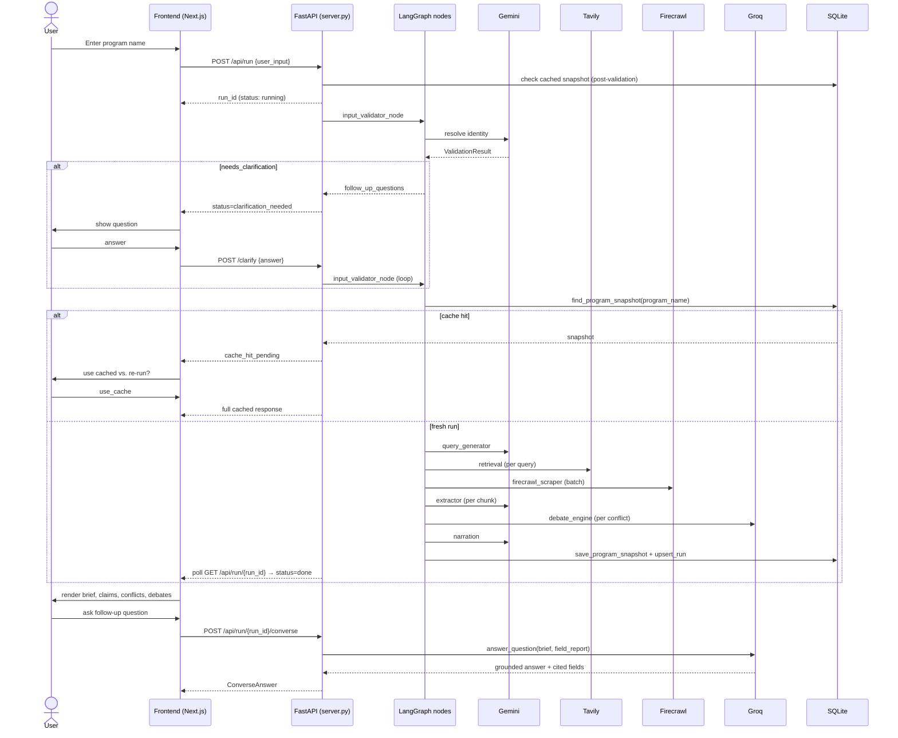

# Kobie — Architecture & Design Document

**Autonomous Competitive Intelligence Agent for Loyalty Programs**

Version 1.0 · Based on the implementation in this repository (`server.py`, `pipeline/`, `core/`, `frontend/`)

---

## 1. Project Overview

Kobie is an autonomous competitive-intelligence agent that researches customer loyalty programs (airline, hotel, retail, etc.) and produces analyst-grade, evidence-grounded briefs. Given a program name (e.g. "Delta SkyMiles", "Marriott Bonvoy"), Kobie:

1. Resolves the input to one canonical program identity via an LLM-backed validator.
2. Plans and executes web research across official, review, forum, and financial sources.
3. Extracts structured facts against a fixed loyalty-program schema (`core/schemas.py::SCHEMA_FIELD_PATHS`), grounded strictly in scraped evidence.
4. Detects and resolves conflicting claims between sources — using deterministic merge strategies for well-understood conflict shapes and a 5-step adversarial LLM debate for genuinely disputed single-truth facts.
5. Synthesizes a narrative brief and lets the user converse with the results, answering only from extracted evidence.
6. Supports side-by-side comparison of two or more programs with a generated comparison brief.

The system is implemented as a **FastAPI backend** (`server.py`) orchestrating a **LangGraph** pipeline (`pipeline/graph.py`), backed by **SQLite** persistence (`core/db.py`), with a **Next.js/React** frontend (`frontend/`) that visualizes pipeline execution, evidence, conflicts, and debates in real time.

## 2. Problem Statement

Loyalty-program intelligence (earn rates, tier thresholds, redemption values, partner networks, member sentiment) is scattered across official program pages, T&Cs, review sites, forums, and app stores. It is:

- **Fragmented** — no single authoritative source covers all of a program's mechanics.
- **Volatile** — earn rates, tier thresholds, and point valuations change frequently (`HIGH_VOLATILITY_FIELDS` in `core/schemas.py`).
- **Contradictory** — independent sources (official pages vs. blogs vs. forums) frequently disagree on the same fact.
- **Expensive to verify manually** — an analyst must cross-reference many pages per program and adjudicate disagreements by hand.

Existing LLM-only approaches hallucinate facts from training data rather than grounding claims in retrievable evidence. Kobie's explicit design constraint (stated in `README.md`) is: **"Never use LLM training memory as a source of loyalty-program facts."** Every supported claim must carry a `source_url` and be traceable to scraped content.

## 3. Objectives

- Resolve ambiguous or partial user input to one canonical program identity, or ask a bounded number of clarifying questions.
- Automatically plan and execute up to 15 targeted search queries per program, covering official, financial, review, forum, and app-store source types.
- Extract structured, schema-conformant facts with per-field confidence, source attribution, and status (`EXTRACTED` / `NOT_FOUND` / `AMBIGUOUS`) — never inferring beyond what is in the scraped text.
- Detect factual conflicts between independently sourced claims and resolve them via the cheapest sufficient strategy: identical-value short-circuit → confidence-gap auto-resolve → field-type deterministic merge → adversarial debate only when necessary.
- Produce a 600–900 word analyst brief and a grounded Q&A interface, with all answers traceable to `field_report` entries.
- Support two-program comparison with category-level verdicts and a synthesized comparison brief.
- Track per-stage status, cost (tokens/USD), and errors for observability, and cache completed runs so repeat lookups are instant.
- Survive process restarts without losing run history (see §13, Reliability).

## 4. High-Level Architecture

```mermaid
flowchart TB
    subgraph Client["Frontend — Next.js 14 / React 18"]
        UI["Run pages: single / compare / history\n(frontend/app)"]
        Components["PipelineGraph, ClaimsTable, ConflictCard,\nDebateTimeline, ComparisonTable, PDF export\n(frontend/components)"]
        APILib["frontend/lib/api.ts\nTanStack Query polling"]
    end

    subgraph Backend["Backend — FastAPI (server.py)"]
        API["REST endpoints:\n/api/run, /api/run/{id}, /clarify,\n/converse, /cache/check"]
        Store["In-memory RunRecord store\n(thread per run)"]
        Graph["LangGraph pipeline\n(pipeline/graph.py)"]
        Cost["core/cost_tracker.py\nper-run cost ledger"]
    end

    subgraph Pipeline["Pipeline Stages (pipeline/stages, pipeline/nodes, pipeline/adjudication)"]
        Validator["input_validator"]
        QueryGen["query_generator"]
        AppRatings["app_ratings"]
        Retrieval["retrieval"]
        WebEnrich["web_enrichment"]
        Firecrawl["firecrawl_scraper"]
        Ingest["ingest: raw_store → chunker →\nextractor → normalizer"]
        Adjudication["adjudication: conflict_adjudicator\n+ debate_engine"]
        Narration["narration"]
    end

    subgraph External["External Services"]
        Gemini["Google Gemini 2.5 Flash\n(validation, query gen, extraction,\nnarration, comparison brief)"]
        Groq["Groq llama-3.3-70b-versatile\n(debate, converse)"]
        Tavily["Tavily Search API"]
        FirecrawlAPI["Firecrawl Scrape API"]
        PlayStore["Google Play Scraper /\niTunes Search API"]
        Wikipedia["Wikipedia REST API"]
    end

    subgraph Storage["Persistence"]
        SQLite[("kobie.sqlite3\nWAL mode")]
    end

    UI --> APILib --> API
    API --> Store --> Graph
    Graph --> Validator --> QueryGen --> AppRatings --> Retrieval --> WebEnrich --> Firecrawl --> Ingest --> Adjudication --> Narration
    Validator -.-> Gemini
    QueryGen -.-> Gemini
    AppRatings -.-> PlayStore
    Retrieval -.-> Tavily
    WebEnrich -.-> Wikipedia
    Firecrawl -.-> FirecrawlAPI
    Ingest -.-> Gemini
    Adjudication -.-> Groq
    Narration -.-> Gemini
    API -.->|converse| Groq
    Graph --> Cost
    API <--> SQLite
    Components --> UI
```



## 5. End-to-End Data Flow

1. **Submission** — user enters a program name in the frontend; `POST /api/run` creates a `RunRecord` and starts `run_pipeline` on a background thread (`server.py`).
2. **Validation** — `input_validator_node` sends the raw input to Gemini with the ArcGuide input-verifier prompt (`pipeline/stages/validation.py`), returning `resolved`, `needs_clarification`, or `rejected`. Clarification answers are submitted via `POST /api/run/{run_id}/clarify` and looped back in (max 3 rounds, 5-minute timeout each).
3. **Cache check** — once a `program_name` is resolved, `core/db.py::find_program_snapshot` looks up a prior completed run by normalized name. If found, the frontend is offered a cached result (`cache_hit_pending` status) via `POST .../clarify`-style decision events instead of re-running the full pipeline.
4. **Query generation** — `query_generator_node` calls Gemini (`pipeline/stages/query_generator.py`) to produce up to 15 `SearchQuery` objects tagged with `source_type` (official, terms, financial, review, forum, app_reviews, ...) and a `field_query_map`.
5. **App ratings prefetch** — `app_ratings_node` calls Google Play Scraper and the iTunes Search API directly (bypassing Tavily/Firecrawl) and builds a pre-normalized packet.
6. **Retrieval** — `retrieval_node` sends every query to Tavily, canonicalizes URLs, and deduplicates into a single ranked URL set (`pipeline/stages/retrieval.py`).
7. **Web enrichment** — `web_enrichment_node` seeds high-confidence direct URLs (official T&Cs, Trustpilot, app store pages — `direct_url_seeder.py`) and fetches a Wikipedia company summary (`wikipedia_fetcher.py`), injecting both without spending Tavily budget.
8. **Firecrawl scraping** — `firecrawl_node` takes the top-N URLs (ordered by `select_urls_for_firecrawl` for source-type diversity) and scrapes each into raw markdown/PDF text (`firecrawl_scraper.py`).
9. **Ingestion** — `ingest_node` (`pipeline/nodes/ingest_node.py`) runs: raw storage → semantic chunking (`chunker.py`, 600–1500 word chunks) → two-phase Gemini extraction (`extractor.py`) → normalization with deterministic identity hashing (`normalizer.py`) → `FieldReport` aggregation.
10. **Adjudication** — `adjudication_node` detects conflicts across normalized packets and resolves them per the strategy hierarchy in §9 (`pipeline/adjudication/conflict_adjudicator.py`, `debate_engine.py`).
11. **Narration** — `narrator_node` synthesizes a 600–900 word brief from the adjudicated `FieldReport` (`pipeline/stages/narration.py`).
12. **Persistence & caching** — the completed state is serialized and saved to `run_snapshots` (keyed by normalized program name) and `runs` (keyed by `run_id`) for history and cache reuse.
13. **Conversation** — the frontend polls `GET /api/run/{run_id}` (TanStack Query) for live stage status; once done, `POST /api/run/{run_id}/converse` answers follow-up questions strictly from `final_brief` + `field_report` via Groq (`converse.py`).
14. **Comparison mode** — for two or more programs, each runs the full pipeline independently (with per-program caching), then `generate_comparison_brief` (`comparison_brief.py`) and `compare_claim_sets` (`comparison.py`) produce category verdicts and a comparison brief.

## 6. System Components and Responsibilities

| Component | File(s) | Responsibility |
|---|---|---|
| REST API | `server.py` | Run lifecycle endpoints, in-memory `RunRecord`/`STORE`, thread-per-run execution, cache/history endpoints, converse endpoints, SSE-free polling model |
| Pipeline orchestration | `pipeline/graph.py` | LangGraph `StateGraph` wiring all nodes; also exposes traced step-by-step runners (`run_validation_chat_traced`) used by tests/CLI |
| Validation stage | `pipeline/stages/validation.py` | LLM-backed identity resolution and clarification |
| Query generation | `pipeline/stages/query_generator.py` | Gemini-driven search query planning with coverage/priority metadata |
| Retrieval | `pipeline/stages/retrieval.py` | Tavily search, URL canonicalization and de-duplication |
| Web enrichment | `pipeline/stages/direct_url_seeder.py`, `wikipedia_fetcher.py` | Zero-cost supplementary evidence (seeded URLs, Wikipedia) |
| App ratings | `pipeline/stages/app_ratings_fetcher.py` | Direct Play Store / App Store rating lookups |
| Scraping | `pipeline/stages/firecrawl_scraper.py` | Firecrawl-backed page/PDF content extraction |
| Ingestion | `pipeline/nodes/ingest_node.py`, `pipeline/stages/raw_store.py`, `chunker.py`, `extractor.py`, `normalizer.py` | Raw storage → chunking → schema extraction → normalization → `FieldReport` |
| Adjudication | `pipeline/adjudication/conflict_adjudicator.py`, `debate_engine.py` | Conflict detection, deterministic merge strategies, adversarial LLM debate |
| Narration | `pipeline/stages/narration.py` | Brief synthesis from adjudicated field data |
| Comparison | `pipeline/stages/comparison.py`, `comparison_brief.py` | Cross-program claim comparison and comparison brief generation |
| Conversation | `pipeline/stages/converse.py` | Grounded Q&A over single-program and comparison results |
| Shared contracts | `core/schemas.py` | Pydantic/TypedDict models, `AgentState`, schema field paths, volatility classification |
| Persistence | `core/db.py` | SQLite DDL/migrations, snapshot cache, run history |
| Provider config | `core/providers.py` | Centralized per-stage LLM/API provider resolution (model, key, base URL) |
| Cost tracking | `core/cost_tracker.py` | Thread-safe per-run token/cost ledger with provider pricing constants |
| Frontend shell | `frontend/app/`, `frontend/components/` | Run submission, live pipeline visualization, claims/conflict/debate inspection, PDF export, history |
| Legacy UI | `app.py` | Streamlit prototype UI (superseded by the Next.js frontend for the primary workflow) |

## 7. Technology Stack

| Layer | Technology | Justification |
|---|---|---|
| Backend framework | FastAPI (`fastapi`, `uvicorn`) | Async-friendly, typed request/response models via Pydantic, auto-generated OpenAPI, straightforward background-thread execution model for long-running pipeline runs |
| Orchestration | LangGraph (`langgraph`) | Explicit `StateGraph` with typed `AgentState`, conditional routing (e.g. clarification vs. resolved), and reusable node functions that are also invoked directly by `server.py` for fine-grained stage control |
| Data modeling | Pydantic v2 (`pydantic`) | Runtime validation of every stage's I/O contract (`core/schemas.py`), `extra="forbid"` to catch schema drift early |
| Persistence | SQLite (stdlib `sqlite3`) | Zero-ops embedded store; WAL mode for concurrent read/write from the API thread and pipeline threads; adequate for single-node research workloads |
| Primary LLM | Google Gemini 2.5 Flash | Used for validation, query generation, extraction, narration, comparison brief — chosen for low cost per token and strong JSON-mode instruction following |
| Debate/Converse LLM | Groq (`llama-3.3-70b-versatile`) | Low-latency inference well suited to the multi-call adversarial debate protocol (up to 5 sequential/parallel calls per conflict) and interactive Q&A |
| Web search | Tavily | Purpose-built search API for LLM agents, returns scored/typed results suited to query-plan-driven retrieval |
| Web scraping | Firecrawl | Handles JS-rendered pages and PDF parsing (annual reports, T&Cs) in one API, converts to clean markdown for chunking |
| App store data | `google-play-scraper`, iTunes Search API | Free, structured, avoids spending Tavily/Firecrawl budget on well-known API-accessible data |
| Frontend framework | Next.js 14 / React 18 | App Router for run/compare/history routes, server + client component split |
| Data fetching | TanStack Query | Polling-based live pipeline status without a custom WebSocket layer |
| Visualization | Recharts, ReactFlow | Recharts for coverage/cost charts; ReactFlow for the live pipeline graph view |
| PDF export | `@react-pdf/renderer` | Client-side PDF generation of single-run and comparison briefs (`components/pdf/`) |
| Testing | `pytest` | Unit/integration coverage across db, retrieval, validation, query generation, graph orchestration, adjudication (`tests/`) |

## 8. Database / Data Models

### 8.1 Persistence layer (`core/db.py`, SQLite, WAL mode)

| Table | Purpose |
|---|---|
| `run_snapshots` | Cache of completed single-program runs, keyed by `program_name_normalized`, storing the full serialized state as `program_state_json` |
| `runs` | Run history/index — `run_id`, `mode`, `status`, `data_quality`, `run_state_json` for full-response reconstruction |
| `program_identities` | Resolved `ProgramIdentity` records |
| `sources` | URL-level metadata: canonical URL, source type, authority score |
| `pages` | Cleaned page text with token counts and sanitizer flags |
| `chunks` | Chunk-level records referencing `pages` |
| `claims` | Per-field claim records with status, confidence, volatility |
| `conflicts` | Conflict records with resolution status and judge reasoning |
| `briefs` | Persisted `BriefOutput` (brief text, cited claims, entailment flag) |
| `conversations` | Q&A history per run |
| `raw_documents` | Post-Firecrawl documents keyed by `url_hash`, with `source_authority` and metadata |
| `normalized_packets` | Normalized extraction packets keyed by `(identity_hash, source_url, chunk_id)` |

`connect()` opens with `PRAGMA journal_mode=WAL` and a 5s busy timeout; `checkpoint()` runs `PRAGMA wal_checkpoint(TRUNCATE)` on FastAPI shutdown so committed data survives even if the `-wal`/`-shm` files are lost (see §13 for the incident this guards against).

### 8.2 Pydantic domain models (`core/schemas.py`)

Core pipeline contracts, all extending `KobieModel` (`extra="forbid"`):

- **Identity/validation**: `ProgramIdentity`, `ValidationResult`, `ClarificationOption`.
- **Planning/retrieval**: `SearchQuery`, `QueryGenerationOutput`, `RetrievedUrl`, `RetrievalOutput`.
- **Evidence**: `ScrapedUrlBlock`, `FirecrawlScrapeOutput`, `RawDocument`, `SemanticChunk`.
- **Extraction**: `ExtractedField` (value, status `EXTRACTED`/`NOT_FOUND`/`AMBIGUOUS`, source URL/snippet, confidence), `ExtractedObjectPacket`, `NormalizedObjectPacket` (adds a deterministic `identity_hash`).
- **Aggregation**: `FieldReportEntry` (per-field value, sources, `rejected_alternatives`, `all_values`, `conflict_type`), `FieldReport`.
- **Adjudication**: `ConflictRecord`, `Claim` (validated against the fixed `SCHEMA_FIELD_PATHS` tuple, with a model-level rule that `SUPPORTED` claims must carry a `source_url` and `access_date`).
- **Output**: `BriefOutput`, `ComparisonOutput`/`ComparisonItem`, `ComparisonBrief` (`CategoryVerdict`, `KeyDifferentiator`, `ProgramPersona`, `ProgramStrategicProfile`, `DifferentiationTheme`), `ConverseAnswer`.
- **Orchestration state**: `AgentState` — a single `TypedDict` threaded through every LangGraph node, holding the full run state (identity, queries, URLs, documents, chunks, packets, field report, conflicts, adjudicated results, claims, brief, errors, timestamps).

`SCHEMA_FIELD_PATHS` fixes 8 categories × ~6–8 fields each (`program_basics`, `earn_mechanics`, `burn_mechanics`, `tier_system`, `partnerships`, `digital_experience`, `member_sentiment`, `competitive_position`), and `HIGH_VOLATILITY_FIELDS` marks which of those are treated as time-sensitive for adjudication weighting.

## 9. AI Agent Pipeline

The pipeline is a **linear LangGraph** (`pipeline/graph.py::build_kobie_graph`) with one conditional branch after validation:

```
START → input_validator ─┬─ resolved ──→ query_generator → app_ratings → retrieval
                          └─ else ──────→ END
        → web_enrichment → firecrawl_scraper → ingest → adjudication → narration → END
```

**Retrieval** — `retrieval_node` fans Gemini-generated queries out to Tavily, deduplicating by canonical URL and keeping the highest-scoring result per URL (`retrieval.py`). `select_urls_for_firecrawl` (`graph.py`) then interleaves URLs round-robin across source types (official, terms, financial, faq, partners, review, app_reviews, news, forum, competitors) so a fixed budget (top 20) still yields broad field coverage instead of many URLs from one high-scoring query.

**Extraction** (`pipeline/stages/extractor.py`) — schema-agnostic, two-phase per chunk: (1) detect which candidate fields are plausibly present, (2) extract values for those fields only, using Gemini with strict JSON-only prompts. Local heuristic scoring filters low-information chunks and penalizes financial/IR-filing chunks for consumer-facing fields (e.g. `membership_count` from a 10-K often means "rooms," not "members") before spending a Gemini call.

**Chunking** (`pipeline/stages/chunker.py`) — heading-based semantic segmentation of scraped markdown, merging small adjacent sections up to a 600-word target (1500-word hard cap), stripping boilerplate lines (cookie banners, nav chrome), and propagating `target_fields` hints from the originating query.

**Validation** — occurs at two points: (1) upstream, `input_validator` resolves/rejects/clarifies the program identity before any spend; (2) downstream, extraction enforces `EXTRACTED`/`NOT_FOUND`/`AMBIGUOUS` status per field so nothing is silently guessed, and `normalizer.py` re-validates suspicious extractions (flagging them `AMBIGUOUS` with confidence held at 0.0) before they can win an auto-resolve.

**Debate** (`pipeline/adjudication/`) — a 5-step adversarial protocol runs only for fields that reach it after cheaper strategies are exhausted (`conflict_adjudicator.py::adjudicator_node`):

1. **Identical value / decisive confidence gap** (`> 0.20`) → auto-resolve to the stronger claim, no LLM call.
2. **Field-type strategy** (`FIELD_STRATEGY_MAP`) → deterministic merge for fields where disagreement is expected and mergeable: `range` (earn rates spanning categories), `union` (partner lists), `recency` (expiry policies — keep the newest), `majority_vote` (booleans like `mobile_app_available`).
3. **Complementary pre-flight classifier** (1 Groq call) → checks if both values can be simultaneously true in different contexts (e.g. different tiers/categories); if so, synthesizes a `MERGE` value using only source-snippet text.
4. **Adversarial debate** (`debate_engine.py::run_debate`) — for genuinely single-truth disputed facts (`point_value_cpp`, `transfer_ratios`, `redemption_thresholds`, ...): two advocate LLM calls argue for their claim from structured metadata only (recency, authority tier, corroboration count, volatility weights) at temperature 0.0; a similarity gate (`arguments_are_differentiated`, cosine similarity < 0.80) decides whether rebuttal rounds run; a judge call (temperature 0.1) returns a strict JSON verdict (`A`/`B`/`MERGE`/`FLAG`) with an explicit hallucination scan step that discards any argument statement not traceable to the supplied metadata.
5. **Flag for human review** — when the judge cannot distinguish claims even after all steps, the conflict is pushed to `human_review_queue` rather than guessed.

**Synthesis / Reporting** — `narrator_node` (`narration.py`) assembles a brief from `FieldReport` entries that survived adjudication (`extracted`/`flagged`/`ambiguous` with a value), organized by the fixed 8-category `_SECTION_ORDER`. `comparison_brief.py` performs the analogous synthesis across two `FieldReport`s, producing category verdicts, key differentiators (with `rejected_note` for overruled claims), personas, and strategic profiles.

## 10. External Integrations

| Service | Used by | Purpose | Config (`core/providers.py`) |
|---|---|---|---|
| Google Gemini 2.5 Flash | `validation.py`, `query_generator.py`, `extractor.py`, `narration.py`, `comparison_brief.py` | JSON-mode structured generation for identity resolution, query planning, field extraction, and narrative synthesis | `GEMINI_API_KEY`/`GEMINI_API_BASE`, overridable per stage (`INPUT_VERIFIER_*`, `QUERY_GENERATOR_*`, `EXTRACTION_*`, `NARRATION_*`) |
| Groq (`llama-3.3-70b-versatile`) | `debate_engine.py`, `converse.py` | Low-latency multi-call adversarial debate; grounded Q&A | `GROQ_API_KEYS` (round-robin pool) or `DEBATE_API_KEY`/`GROQ_API_KEY`, `CONVERSE_API_KEY` |
| Tavily Search API | `retrieval.py` | Query-driven candidate URL discovery, 5 results/query | `TAVILY_API_KEY`/`TAVILY_API_BASE` |
| Firecrawl | `firecrawl_scraper.py` | Page/PDF scraping to clean markdown (JS rendering + PDF parsing) | `FIRECRAWL_API_KEY`/`FIRECRAWL_API_BASE` |
| Google Play Scraper (library) + iTunes Search API | `app_ratings_fetcher.py` | Direct app rating lookups, bypassing search/scrape spend | No key required |
| Wikipedia REST API | `wikipedia_fetcher.py` | Free company/brand summary injected as a synthetic evidence block | No key required |

There is no vector database in the current implementation — chunk selection for extraction uses heuristic scoring (`extractor.py`) rather than embedding similarity search; `ChunkRef`/`embedding_hash` exist in the schema and DDL as forward-compatible fields but are not populated by an embedding pipeline today.

## 11. Sequence Diagram



## 12. Design Decisions and Trade-offs

| Decision | Rationale | Trade-off |
|---|---|---|
| LangGraph nodes invoked both via compiled graph and directly by `server.py` | `server.py::_run_single_pipeline` calls node functions (`input_validator_node`, `query_generator_node`, ...) directly rather than `KOBIE_GRAPH.invoke()`, so it can update per-stage UI status, handle clarification/cache pause points, and support cancellation (`stop_event`) mid-run | Two execution paths (compiled graph vs. manual node calls) must be kept behaviorally consistent; `run_single`/`run_validation_chat_traced` exist mainly for tests/CLI |
| Thread-per-run instead of async task queue | Simple to reason about; each `RunRecord` owns a `threading.Lock`, `Event`s for clarification/cache decisions, and a `stop_event` | Does not horizontally scale beyond a single process; acceptable for a single-node research tool, not a multi-tenant SaaS |
| In-memory `STORE` + SQLite snapshot fallback | Live runs are served from memory for low-latency polling; completed runs are persisted so history/converse survive process restarts | Any run still `running` when the process restarts is lost (no crash-resume) — only completed/cached runs persist |
| Cheapest-sufficient conflict resolution ladder (§9) | Full 5-step debate costs 3–5 LLM calls per conflict; most conflicts are resolvable deterministically (identical values, decisive confidence gaps, known-mergeable field types) | Requires maintaining `FIELD_STRATEGY_MAP`/volatility tables by hand; misclassifying a field's strategy could suppress a real debate |
| Debate advocates see only structured metadata, never raw source text | Prevents the debate from re-hallucinating training-data facts; keeps arguments auditable and reproducible at low temperature | Debate quality is bounded by how well `value/source_url/date/authority/corroboration/confidence` capture the actual disagreement — subtle textual nuance is lost |
| Gemini for extraction/narration, Groq for debate/converse | Splits cost/latency profiles: Gemini 2.5 Flash is cheap for high-volume per-chunk extraction; Groq's fast inference suits the multi-round, latency-sensitive debate protocol and interactive chat | Two provider integrations to maintain, two sets of rate limits/keys to manage |
| Round-robin Groq key pool (`GROQ_API_KEYS`) with 401 auto-eviction | Groq's free-tier rate limits fail under debate's concurrent multi-call bursts; spreading calls across keys and immediately rotating past invalid/rate-limited keys keeps debates from stalling | Adds pool-management complexity (`_CLIENT_POOL`, `_remove_client_from_pool`) that must be reset per run (`_de._CLIENT_POOL = None`) to avoid stale event-loop binding |
| No vector DB / embedding retrieval | Query-plan-driven Tavily search + heuristic chunk scoring was sufficient for the fixed, well-known schema and kept the system dependency-light | Chunk selection for extraction can miss relevant text that a semantic search would surface; `embedding_hash` columns exist unused as a migration path |
| SQLite over a client-server DB | Zero-ops for a single-node deployment; WAL mode gives adequate read/write concurrency for the API + pipeline threads | Not suitable for multi-instance deployment without moving to a shared DB; WAL journal files are a known failure point (§13) |

## 13. Scalability, Reliability, Security, and Observability

**Scalability** — the current design is single-process/single-node: `STORE` is an in-memory dict guarded by `STORE_LOCK`, and each run occupies one Python thread for its lifetime. Compare-mode runs programs sequentially per record (`run_pipeline`), not in parallel, to keep the shared cost ledger/stage-status model simple. Horizontal scaling would require externalizing `STORE` (e.g. to Redis or the DB) and moving run execution to a task queue (Celery/RQ) or async workers.

**Reliability**
- `core/db.py::checkpoint()` runs `PRAGMA wal_checkpoint(TRUNCATE)` on FastAPI `shutdown`, merging the WAL into the main DB file. `server.sh::check_and_repair_db` also runs an integrity check on startup and, if the DB is corrupt, moves the corrupted files aside into `db_corrupted_backup/` and creates a fresh DB rather than failing to start.
- Per-program result caching (`run_snapshots`, keyed by normalized program name) means a crashed or restarted process does not force a full re-scrape for programs already analyzed.
- Every pipeline node wraps its logic in `try/except`, appending a `PipelineError(stage, message)` to `state["errors"]` and marking the corresponding UI stage `"error"` rather than raising and killing the run silently.
- Clarification and cache-decision waits use `threading.Event.wait(timeout=300)` so a run can never hang indefinitely waiting on user input.

**Security**
- All third-party API keys are loaded from `.env` via `python-dotenv` (`core/providers.py`) and never hard-coded; `_first_env_value(..., reject_placeholders=True)` explicitly rejects `.env.example` placeholder values (`your_...`) so misconfiguration fails closed rather than silently using a fake key.
- CORS is restricted to `localhost:3000`/`3001` and `127.0.0.1` equivalents (`server.py`), appropriate for local/dev deployment; there is no authentication/authorization layer on the API — this is a gap to close before any non-local deployment.
- Extraction and debate prompts include explicit "hallucination fence" instructions constraining the model to only cite supplied metadata/text, functioning as a prompt-injection-resistant grounding discipline rather than a formal security control.

**Observability**
- `core/cost_tracker.py::CostLedger` records per-provider, per-stage call counts and token usage, converting to USD via hard-coded pricing constants (Gemini, Groq, Tavily-per-call, Firecrawl-per-page), exposed per run via `cost_report` in the API response.
- Structured stage status (`UI_STAGES` in `server.py`) is tracked per run (and per program in compare mode) and streamed to the frontend via polling, giving real-time visibility into which node is running/done/errored.
- `logs/backend.log`, `logs/frontend.log`, and a dedicated `logs/debate_debug.log` (via a `FileHandler` in `debate_engine.py`) isolate debate-engine diagnostics (key pool state, judge parsing failures) for troubleshooting adversarial-debate issues specifically.

## 14. Error Handling and Retry Strategy

- **Node-level isolation** — every graph node (`input_validator_node`, `query_generator_node`, `retrieval_node`, `firecrawl_node`, `ingest_node`, `adjudication_node`, `narrator_node`) catches exceptions internally and returns a `PipelineError` delta rather than propagating, so one stage's failure produces a clear UI error state without crashing the run thread.
- **Firecrawl partial failure** — `firecrawl_node` continues even if individual URLs fail (`scrape_status: "failed"/"forbidden"`); the run only errors out if *zero* URLs succeed (`successful_scrapes > 0` check in `_run_single_pipeline`).
- **Groq rate limiting** — `debate_engine.py::call_groq` retries up to `pool_size * 2` attempts, immediately rotating to the next key in the pool on a 429 before falling back to a suggested-delay sleep (parsed from the error message via regex, default exponential backoff). A 401 response permanently evicts that key from the pool (`_remove_client_from_pool`) rather than retrying it.
- **Judge output parsing** — `parse_judge_output` tolerates markdown code fences and malformed JSON, falling back to a deterministic `FLAG` verdict (`FLAG_FALLBACK_REASONING`) rather than raising, so a single bad LLM response degrades to "needs human review" instead of failing the whole adjudication step.
- **Non-fatal enrichment failures** — `web_enrichment_node` treats URL-seeding and Wikipedia-fetch errors as non-fatal, logging via `_log_enrichment_error` and continuing with whatever succeeded.
- **Clarification/cache timeouts** — bounded to 300s via `threading.Event.wait`, after which the run is marked `error` rather than hanging.
- **User-triggered cancellation** — `record.stop_event` is checked before every stage transition (`_stopped(record)`), allowing a run to be cancelled cleanly mid-pipeline with all in-flight "running" stages marked `error` and `run_status` set to `cancelled`.
- **Debate-level fallback** — if the debate engine itself raises (`_safe_one` in `conflict_adjudicator.py`), the conflict is caught and converted to a `FLAG` result with `deciding_factor: "unresolvable"` and a `final_confidence` of 0.40, guaranteeing adjudication always completes for every conflict.

## 15. Future Enhancements

Based on scaffolding already present but not yet wired into the runtime pipeline:

- **`verification.py`** exists as a standalone confidence-scoring/conflict-detection module (recency, authority, corroboration, volatility) separate from the now-implemented `conflict_adjudicator.py` — candidate for consolidation or removal once superseded logic is confirmed redundant.
- **`extraction.py`** contains claim-extraction helpers for manual-review "absent field" scaffolding, described in `docs/forme.md` as "not yet a full runtime extraction pipeline" — the current `extractor.py` has since become the runtime path; this module's role should be clarified or retired.
- **Embedding-based retrieval** — `ChunkRef.embedding_hash` and the `chunks` table schema anticipate a future move from heuristic chunk scoring to semantic (vector) search for chunk selection, without requiring schema changes.
- **Multi-instance scaling** — externalizing `STORE`/run execution (§13) to support concurrent runs across multiple backend processes.
- **Authentication/authorization** — the API currently has no auth layer; needed before any deployment beyond local development.
- **Streaming updates** — the frontend currently polls `GET /api/run/{run_id}`; a WebSocket or SSE channel would reduce polling overhead and latency for stage-status updates.
- **Crash-resumable runs** — persisting intermediate `AgentState` per stage (not just on completion) would let a restarted process resume an in-flight run instead of losing it.

## 16. Conclusion

Kobie implements a grounded, multi-stage research pipeline that treats "never hallucinate a fact" as an architectural constraint rather than a prompt-only aspiration: every extracted value carries a source URL, conflicting claims are resolved through an auditable ladder of deterministic strategies and metadata-only adversarial debate, and the narrative brief and conversational Q&A are both constrained to synthesize only from that adjudicated evidence. The LangGraph-based pipeline, FastAPI orchestration layer, and SQLite persistence form a pragmatic single-node system — well suited to its current scope as a research/analyst tool — with clear, already-scaffolded paths (embedding retrieval, auth, multi-instance scaling, crash resumption) toward a more scalable deployment.
